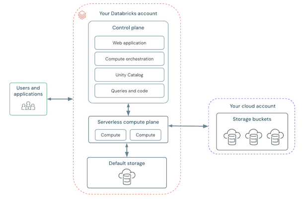
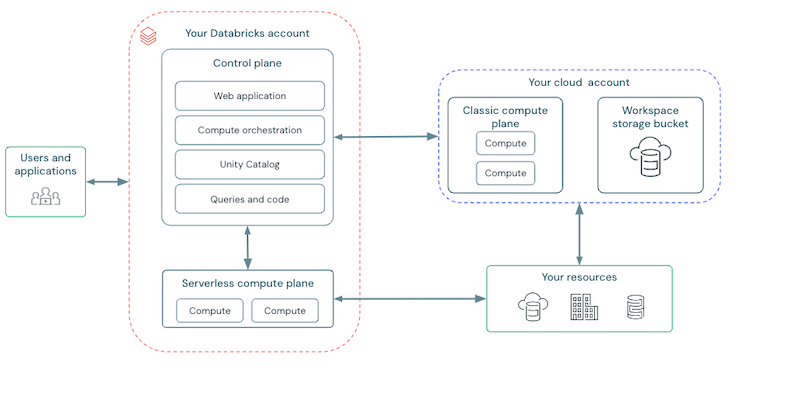

# Platform

A high-level overview of the Databricks platform.

## Table of Contents

> - [Workspace Architecture](#workspace-architecture)
>   - [Serverless Workspace Architecture](#serverless-workspace-architecture)
>   - [Classic Workspace Architecture](#classic-workspace-architecture)
> - [Workspace Storage](#workspace-storage)
> - [Workspace UI](#workspace-ui)
> - [Account and Workspaces](#account-and-workspaces)
>   - [Account](#account)
>   - [Workspace](#workspace)
> - [Unity Catalog](#unity-catalog)
>   - [Metastore](#metastore)
>   - [Catalog Explorer](#catalog-explorer)
>     - [Catalog](#catalog)
>     - [Schema](#schema)
>     - [Table](#table)
>     - [View](#view)
>     - [Volume](#volume)
>     - [Function](#function)
>   - [Tags](#tags)
> - [Git Folders](#git-folders)

---

## Workspace Architecture

[Reference](https://docs.databricks.com/aws/en/getting-started/high-level-architecture#workspace-architecture)

Databricks is split into 2 logical planes:
- **Control Plane**: includes backend services that live
  in the Databricks cloud account. It hosts:
  - Web application & workspace UI
  - Notebooks, queries, dashboards, and their configurations
  - Job scheduler and workflow orchestration
  - Cluster manager
  - Metadata management
- **Compute Plane**: defines where data processing happens.
  Clusters and SQL Warehouses run here.

### Serverless Workspace Architecture

A fully managed deployment,
preconfigured with serverless compute and default storage.\
Requires **Unity Catalog**.

Compute Plane:
- runs only in the serverless compute plane, inside the Databricks account
- fully managed, instantly available, autoscaled

Storage:
- provides a default storage - a fully managed object store in the Databricks account
- it's also possible to connect to the customer's cloud storage



### Classic Workspace Architecture

The traditional deployment, 
where the customer owns the infrastructure that hosts compute and storage.

Compute Plane:
- runs inside the customer's VPC
- serverless compute is also available and runs inside the Databricks account

Storage:
- data lives in customer-managed cloud object storage
- default storage is used only for specific features



---

## Workspace Storage

A workspace storage consists of:
- workspace file system data (Notebooks/SQL queries/Alerts/Libraries/Python files)
- workspace system data (Files generated internally, e.g. Notebook revisions, Job run results, Cluster logs)

---

## Workspace UI

There are 3 options:
- Data Engineering (building and operating data pipelines)
  - Notebooks
  - Data ingestion (_e.g._ Auto Loader, connectors)
  - Lakeflow Declarative Pipelines
  - Lakeflow Jobs
  - Compute (all-purpose & job clusters)
- Databricks SQL (analytics and BI over a lakehouse)
  - SQL Editor 
  - Queries
  - Dashboards
  - Alerts
  - SQL Warehouses
- AI/ML (end-to-end machine learning & GenAI workflows)
  - Experiments and MLflow tracking
  - Models & model registry
  - Feature engineering & feature store
  - Model Serving
  - AI Playground and agent/GenAI tooling

---

## Account and Workspaces

These are the top 2 organizational constructs

### Account

An account represents a single entity that can include multiple workspaces.
An account with enabled for Unity Catalog can be used to
manage users and their access to data centrally across
all the workspaces in the account.

Account is used for (through an account console):
- **Identity and access**: users, groups, and service principals
  that are managed centrally and assigned to workspaces
- **Workspace management**: creating and configuring workspaces across regions
- **Metastore management**: creating Unity Catalog metastores (one per region)
- **Billing**
- **Compliance**
- **Account-level policies**

### Workspace

It's a Databricks deployment in the cloud, a collaboration environment
where users actually run workloads.
It groups the assets a team works with and provides access to data.

Features:
- A workspace links to a single Unity Catalog metastore in the same region
- Data is addressed through the 3-level namespace:
  - `catalog-name`
  - `schema-name`
  - `object-name`
- Each workspace has a deployment type
  - classic
  - serverless

---

## Unity Catalog

[Reference](https://docs.databricks.com/aws/en/data-governance/unity-catalog/)

A unified governance solution for **data and AI** across all workspaces in an account,
providing centralized access control, auditing, lineage, and data discovery.

It organizes data in a **three-level namespace**:\
`<catalog-name>.<schema-name>.<object-name>`

### Metastore

The **top-level container of metadata** in Unity Catalog, at the **account level**.\
It registers metadata about data and AI assets (catalogs, schemas, tables, _etc._)
and the permissions that govern them.

Key notes: 
- Created and managed from the **account console**.
- One metastore per region
- One workspace is linked to a single metastore
- There's a legacy `hive_metastore` that predates Unity Catalog

### Catalog Explorer

[Reference](https://docs.databricks.com/aws/en/catalog-explorer/)

The workspace UI for browsing and managing Unity Catalog objects.

Key functionalities:
- Navigate catalogs, schemas, tables, volumes, models, and functions
- Inspect schema, sample data, details, and permissions of an object
- `GRANT` / `REVOKE` privileges through the UI
- View data lineage and history
- Manage external locations, storage credentials, and connections

#### Catalog

The highest level container for organizing and isolating data in Databricks.
It's possible to share catalogs across workspaces within the same region and account.
 
3 Types of Catalogs:
- Standard
- Foreign (federated tables from external systems that enable to perform read-only queries)
- `hive_metastore` - tables using the built-in legacy Hive metastore
- 
Each catalog typically has its own managed storage location
to store managed tables and volumes.
 
###### Create a Catalog
```
CREATE CATALOG [IF NOT EXISTS] <catalog-name>
[MANAGED LOCATION '<location-path>'];
```

###### View a Catalog
```
DESCRIBE CATALOG [EXTENDED] <catalog-name>;
```

###### Delete a Catalog
```
DROP CATALOG [IF EXISTS] <catalog-name> [CASCADE];
```

###### Describe a Catalog
```
DESCRIBE CATALOG [EXTENDED] <catalog-name>;
```
The description contains:
- catalog name
- owner
- catalog type
- [extended] creation/modification timestamps

#### Schema

The containers within catalogs that provide more granular level of organization.\
They contain tables, volumes, functions, and models.
 
It's possible to define a managed storage location for the schema.\
If it's not specified, then the managed storage location will be inherited from the catalog.
 
###### Create a Schema
```
CREATE SCHEMA [IF NOT EXISTS] <catalog-name>.<schema-name>
[MANAGED LOCATION '<location-path>']
[WITH DBPROPERTIES (<property-key>=<property-value>, ...)];
```
 
###### View a Schema
```
DESCRIBE SCHEMA [EXTENDED] <catalog-name>.<schema-name>;
```
 
###### Delete a Schema
```
DROP SCHEMA [IF EXISTS] <catalog-name>.<schema-name> [CASCADE];
```

###### Describe a Schema
```
DESCRIBE SCHEMA [EXTENDED] <catalog-name>.<schema-name>;
```
The description contains:
- database name
- description
- location path
- [extended] properties

#### Table

Tables organize and govern access to structured data.\
Querying is achieved via Apache Spark SQL and Apache Spark APIs.
 
By default, all tables created in Databricks are **Delta Tables**.
 
4 types:
- Managed (Databricks manages both metadata and data files)
- External (Databricks manages metadata, data files are stored externally)
- Federated/Foreign (referencing read-only data in external systems)
- Temporary (session-scoped tables)

To set/unset a table to be managed, use this command:
```
ALTER TABLE <table> SET/UNSET MANAGED;
```
Setting a managed table has the advantages:
- minimizes reader and writer downtime
- handles concurrent writes during conversion
- redirects path-based reads and writes 
  to allow legacy code to function after conversion
- supports rolling back the converted managed table to an external table

###### Describe a Table
```
DESCRIBE TABLE [EXTENDED] <catalog-name>.<schema-name>.<table-name>;
```
The description contains:
- column names with data types and comments
- [extended] location path
- [extended] type (managed/external)
- [extended] comment
- [extended] table properties
- [extended] row filters
- [extended] column masks

If you're interested about a particular state of a Delta table(_e.g._ file count _etc.):
```
DESCRIBE DETAIL <catalog-name>.<schema-name>.<table-name>;
```

#### View

A read-only object derived from one or more tables and views.

In addition to standard/plain views there are also the following views:
- **Metric Views**: Define reusable business metrics
  that are centrally maintained and accessible to all users
- **Materialized Views**: Incrementally calculate and update the results
  returned by the defining query. Unlike a plain view (computed on read),
  a materialized view stores its results as a managed table and
  refreshes them as a batch target.
- **Temporary Views**: Have limited scope and persistence and
  are not registered to a schema or catalog
 
###### Create a View
```
CREATE VIEW <catalog-name>.<schema-name>.<view-name> AS
SELECT <query>;
```
 
###### Delete a View
```
DROP VIEW [IF EXISTS] <catalog-name>.<schema-name>.<view-name>;
```

#### Volume

A logical volume of storage in a cloud object storage location,
which governs access to non-tabular data.
 
2 types:
- Managed volumes - Databricks-managed storage
- External volumes - governance over existing cloud object storage locations

To access data in a volume the following path must be used:
```
/Volumes/<catalog-name>/<schema-name>/<volume-name>/<location-path>/<file-name>
```

###### Create a Volume
```
CREATE VOLUME <catalog-name>.<schema-name>.<volume-name>;
```
 
###### Create an External Volume
```
CREATE EXTERNAL VOLUME <catalog-name>.<schema-name>.<volume-name>
LOCATION '<location-path>';
```

###### Delete a Volume
```
DROP VOLUME [IF EXISTS] <catalog-name>.<schema-name>.<volume-name>;
```

#### Function

A securable Unity Catalog object, registered to a schema,
that stores reusable **User-Defined Functions** (UDFs) invocable in queries.
 
Types:
- SQL UDFs - a single expression or query written in SQL
- Python UDFs - arbitrary Python logic (registered to Unity Catalog)

Scalar functions return one value.\
Table functions return a set of rows

###### Create a Function
```
CREATE [OR REPLACE] FUNCTION <catalog-name>.<schema-name>.<function-name>(<argument-name> <data-type>, ...)
RETURNS <data-type>
RETURN <function-body>;
```
 
Example:
```
CREATE OR REPLACE FUNCTION mask_email(email STRING) RETURNS STRING
  RETURN
    CASE 
      WHEN is_account_group_member('admins') THEN email
      ELSE '***@***.***'
    END;
```

###### Delete a function
```
DROP FUNCTION [IF EXISTS] <catalog-name>.<schema-name>.<function-name>;
```

### Tags

Tags are attribute metadata used for organization and search.
They are the basis for **ABAC** governance
(governed tags drive column masks and row filters).
 
###### Set a tag
```
SET TAG ON <object-type> <object-name> `<tag-key>` = `<tag-value>`
```

###### Set multiple tags
```
ALTER TABLE <table> ALTER COLUMN <column-name> SET TAGS ('<tag-key>' = '<tag-value>, ...')
```

###### Unset a tag
```
UNSET TAG ON <object-type> <object-name> <tag-key>
```

---

## Git Folders

[Reference](https://docs.databricks.com/aws/en/repos)
 
Git folders/Databricks repos simplify the work with the code
stored in a remote git repository.
 
They allow all the operations except:
- Creation of pull requests
- Branch removal

---